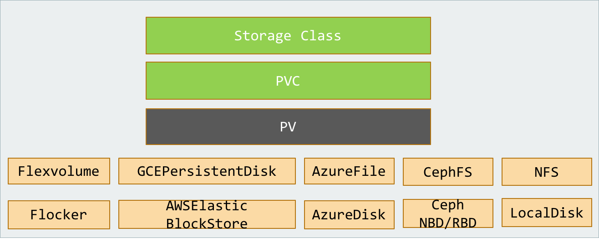

# Kubernetes的架构与设计理念

这一章将介绍 Kubernetes 的架构和设计理念

### 架构
Kubernetes 遵循非常传统的客户端服务端架构，客户端通过 RESTful 接口或者直接使用 kubectl 与 Kubernetes 集群进行通信，这两者在实际上并没有太多的区别，后者也只是对 Kubernetes 提供的 RESTful API 进行封装并提供出来。


每个 Kubernetes 集群都由一组 Master 节点和一系列的 Worker 节点组成，其中 Master 节点主要负责存储集群的状态，并为 Kubernetes 对象分配和调度资源。

#### Master
作为管理集群状态的 Master 节点，它主要负责接收客户端的请求，创建资源对象，对容器进行调度，并且运行控制循环，将集群的状态向目标状态进行迁移，Master 节点内部由三个组件构成：  


***API Server*** 负责处理来自用户的请求，其主要作用就是对外提供 RESTful 的接口，包括用于查看集群状态的读请求以及改变集群状态的写请求，也是唯一一个与 etcd 集群通信的组件。  
***Controller Manager*** 运行了一系列的控制器进程，这些进程会按照用户的期望状态在后台不断地调节整个集群中的对象，当服务的状态发生了改变，控制器就会发现这个改变并且开始向目标状态迁移。  
***Scheduler*** 为在 Kubernetes 中创建的 Pod 选择部署的 Worker 节点，它会根据用户的需要选择最能满足需求的节点来调度 Pod，它会在每次需要调度 Pod 时执行。
#### Worker
***Worker*** 主要由 kubelet 和 kube-proxy 两部分组成

***kubelet*** 周期性地从 API Server 获取新的或者修改的 Pod 规范并且保证节点上的 Pod 和其中容器的正常运行；它还会保证worker节点会向目标状态迁移，同时会向 Master 节点发送宿主机的健康状况。  
***kube-proxy*** 负责将服务暴露给外部，其原理就是在多个隔离的网络中把请求转发给正确的 Pod 或者容器。

------
### Kubernetes设计理念与分布式系统

分析和理解Kubernetes的设计理念可以使我们更深入地了解Kubernetes系统，更好地利用它管理分布式部署的云原生应用，另一方面也可以让我们借鉴其在分布式系统设计方面的经验。

### 分层抽象设计

Kubernetes设计理念和功能其实就是一个类似Linux的分层架构，如下图所示


* 核心层：Kubernetes最核心的功能，对外提供API构建高层的应用，对内提供插件式应用执行环境
* 应用层：部署（无状态应用、有状态应用、批处理任务、集群应用等）和路由（服务发现、DNS解析等）
* 管理层：系统度量（如基础设施、容器和网络的度量），自动化（如自动扩展、动态Provision等）以及策略管理（RBAC、Quota、PSP、NetworkPolicy等）
* 接口层：kubectl命令行工具、客户端SDK以及集群联邦
* 生态系统：在接口层之上的庞大容器集群管理调度的生态系统，可以划分为两个范畴
  * Kubernetes外部：日志、监控、配置管理、CI、CD、Workflow、FaaS、OTS应用、ChatOps等
  * Kubernetes内部：CRI、CNI、CVI、镜像仓库、Cloud Provider、集群自身的配置和管理等

----
### 设计理念  

  

这里将按照顺序分别介绍声明式、显式接口、无侵入性和可移植性这几个设计理念。

-----
#### 声明式:
声明式（Declarative）的编程方式一直都会被工程师们拿来与命令式（Imperative）进行对比，这两者是完全不同的编程方法。

***声明式 VS 命令式***
>命令式编程（Imperative）：详细的命令机器怎么（How）去处理一件事情以达到你想要的结果（What）；
声明式编程（ Declarative）：只告诉你想要的结果（What），机器自己摸索过程（How）  
[举例说明](https://zhuanlan.zhihu.com/p/34445114)


在 Kubernetes 中，我们可以直接使用 YAML 文件定义服务的拓扑结构和状态：
```YAML
apiVersion: v1
kind: Pod
metadata:
  name: rss-site
  labels:
    app: web
spec:
  containers:
    - name: front-end
      image: nginx
      ports:
        - containerPort: 80
    - name: rss-reader
      image: nickchase/rss-php-nginx:v1
      ports:
        - containerPort: 88
```

声明式的方式能够大量地减少使用者的工作量，极大地增加开发的效率，这是因为声明式能够简化需要的代码，减少开发人员的工作，如果我们使用命令式的方式进行开发，虽然在配置上比较灵活，但是带来了更多的工作。

Kubernetes 中的 YAML 文件也有着相同的原理，用户可以告诉 Kubernetes 想要的最终状态是什么，而它会帮助我们从现有的状态进行迁移。

如果 Kubernetes 采用命令式编程的方式提供接口，那么工程师可能就需要通过代码告诉 Kubernetes 要达到某个状态需要通过哪些操作，相比于更关注状态和结果声明式的编程方式，命令式的编程方式更强调过程。  
***总结：***
Kubernetes 中声明式的 API 其实指定的是集群期望的运行状态，所以在出现任何不一致问题时，它本身都可以通过指定的 YAML 文件对线上集群进行状态的迁移，就像一个水平触发的系统，哪怕系统错过了相应的事件，最终也会根据当前的状态自动做出做合适的操作。

-----
#### 显式接口
Kubernetes 的接口设计规范是不存在内部的私有接口，所有的接口都是显示定义的，组件之间通信使用的接口对于使用者来说都是显式的，我们都可以直接调用。

当 Kubernetes 的接口不能满足工程师的复杂需求时，我们需要利用已有的接口实现更复杂的特性，在这时 Kubernetes 的这一设计就不会成为自定义需求的障碍。

----

#### 无侵入性
为了尽可能满足用户（工程师）的需求，减少工程师的工作量与任务并增强灵活性，Kubernetes 为工程师提供了无侵入式的接入方式，每一个应用或者服务一旦被打包成了镜像就可以直接在 Kubernetes 中无缝使用，不需要修改应用程序中的任何代码。

Docker 和 Kubernetes 就像包裹在应用程序上的两层，它们两个为应用程序提供了容器化以及编排的能力，在应用程序内部却不需要任何的修改就能够在 Docker 和 Kubernetes 集群中运行，这是 Kubernetes 在设计时选择无侵入带来最大的好处，同时无侵入的接入方式也是目前几乎所有应用程序或者服务都必须考虑的一点。

-----
#### 可移植性
在微服务架构中，我们往往都会让所有处理业务的服务变成无状态的服务，以前在内存中存储的数据、Session 等缓存，现在都会放到 Redis、ETCD 等数据库中存储，微服务架构要求我们对业务进行拆分并划清服务之间的边界，所以有状态的服务往往会对架构的水平迁移带来障碍。

然而有状态的服务其实是无可避免的，我们将每一个基础服务或者业务服务都变成了一个个只负责计算的进程，但是仍然需要有其他的进程负责存储易失的缓存和持久的数据，Kubernetes 对这种有状态的服务也提供了比较好的支持。

Kubernetes 引入了 PersistentVolume 和 PersistentVolumeClaim 的概念用来屏蔽底层存储的差异性，目前的 Kubernetes 支持下列类型的 PersistentVolume：


这些不同的 PersistentVolume 会被用户声明的 PersistentVolumeClaim 分配到不同的服务中，对于上层来讲所有的服务都不需要感知 PersistentVolume，只需要直接使用 PersistentVolumeClaim 得到的卷就可以了。
