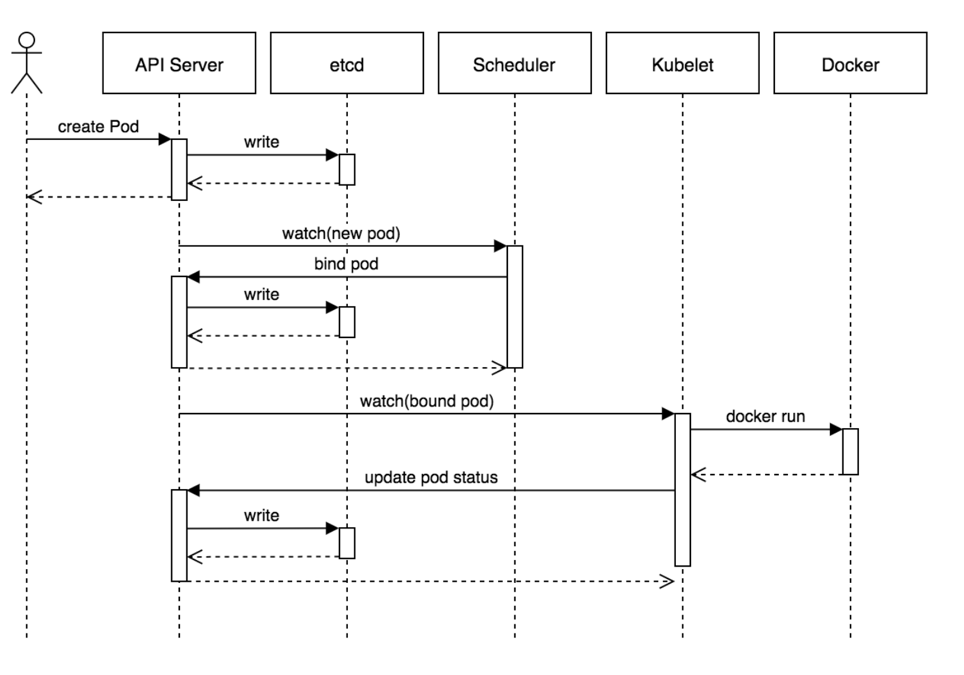

# Pod概览

## 理解Pod

Pod 是kubernetes中可以创建和部署的最小单位。Pod也代表着集群中一个运行的进程。pod通过提供一个更高级别的抽象的方式能够简化应用部署管理。
Pod 中封装着应用的容器（有的情况下是好几个容器），存储、独立的网络IP，管理容器如何运行的策略选项。Pod 代表着部署的一个单位：kubernetes 中应用的一个实例，可能由一个或者多个容器组合在一起共享资源。

> [Docker](https://www.docker.com)是kubernetes中最常用的容器运行时，但是Pod也支持其他容器运行时。


在Kubernetes 集群中Pod有如下两种使用方式：

- **一个Pod中运行一个容器**。“每个Pod中一个容器”的模式是最常见的用法；在这种使用方式中，你可以把Pod想象成是单个容器的封装，kuberentes管理的是Pod而不是直接管理容器。
- **在一个Pod中同时运行多个容器**。一个Pod中也可以同时封装几个需要紧密耦合互相协作的容器，它们之间共享资源。这些在同一个Pod中的容器可以互相协作成为一个service，一个容器从Volume中获取文件，另一个“sidecar”容器来更新这些文件。Pod将这些容器和存储资源作为一个实体来管理。

[Kubernetes Blog](http://blog.kubernetes.io) 有关于Pod用例的详细信息，查看：

- [The Distributed System Toolkit: Patterns for Composite Containers](https://kubernetes.io/blog/2015/06/the-distributed-system-toolkit-patterns/)
- [Container Design Patterns](https://kubernetes.io/blog/2016/06/container-design-patterns/)

每个Pod都是应用的一个实例。如果你想平行扩展应用的话（运行多个实例），你应该运行多个Pod，每个Pod都是一个应用实例。在Kubernetes中，这通常被称为replication。

----
### Pod中如何管理多个容器

Pod中可以同时运行多个进程（作为容器运行）协同工作。同一个Pod中的容器会自动的分配到同一个 node 上。同一个Pod中的容器共享资源、网络环境和依赖，它们总是被同时调度。

注意在一个Pod中同时运行多个容器是一种比较高级的用法。只有当你的容器需要紧密配合协作的时候才考虑用这种模式。例如，你有一个容器作为web服务器运行，需要用到共享的volume，有另一个“sidecar”容器来从远端获取资源更新这些文件，如下图所示：


-----
**Pod中共享两种资源：网络和存储**

#### 网络

每个Pod都会被分配一个唯一的IP地址。Pod中的所有容器共享网络空间，包括IP地址和端口。Pod内部的容器可以使用`localhost`互相通信。Pod中的容器与外界通信时，必须分配共享网络资源（例如使用宿主机的端口映射）。

#### 存储

可以为一个Pod指定多个共享的Volume。Pod中的所有容器都可以访问共享的volume。Volume也可以用来持久化Pod中的存储资源，以防容器重启后文件丢失。

## 使用Pod

你很少会直接在kubernetes中创建单个Pod(bare pod)。因为Pod的生命周期是短暂的。当Pod被创建后（不论是由用户直接创建还是被其他Controller），都会被scheduler调度到集群的某个Node上。直到Pod的进程终止、被删掉；只要不是因为缺少资源而被驱逐、或者Node故障之前这个Pod都会一直保持在那个Node上。

> 注意：重启Pod中的容器跟重启Pod不是一回事。Pod只提供容器的运行环境并保持容器的运行状态，重启容器不会造成Pod重启。

Bare Pod不会自愈。如果Pod运行的Node故障，或者是调度失败，这个Pod就会被删除。同理，如果Pod所在Node缺少资源或者Node处于维护状态，Pod也会被驱逐。

***那么该如何防止pod不会丢失呢？***  
Kubernetes使用更高级的称为Controller的抽象层，来管理Pod实例。虽然用户可以直接使用Pod，但是在Kubernetes中通常是使用Controller来管理Pod的。

### Pod 和 Controller

Controller可以创建和管理多个Pod，提供副本管理、滚动升级和集群级别的自愈能力。例如，如果一个Node故障，Controller就能自动将该节点上的Pod调度到其他健康的Node上。

包含一个或者多个Pod的Controller示例：

- [Deployment](deployment.md)
- [StatefulSet](statefulset.md)
- [DaemonSet](daemonset.md)

***PS:****
```
StatefulSet 控制器支持有状态的Pod。在1.4版本中被称为PetSet。在kubernetes之前的版本中创建有状态 pod 的最佳方式是创建一个replica为1的replication controller。
```

通常情况下，Controller会用你提供的Pod Template来创建相应的Pod。

### Pod Templates

Pod模版是包含了其他object的Pod定义，例如Deployment，StatefulSet和
DaemonSets。Controller根据Pod模板来创建实际的Pod。
```yaml
apiVersion: v1
kind: Pod
metadata:
  name: myapp-pod
  labels:
    app: myapp
spec:
  containers:
  - name: myapp-container
    image: busybox
    command: ['sh', '-c', 'echo Hello Kubernetes! && sleep 3600']
```

#### POD的创建


这个时序图展示了创建pod的流程，基本的流程如下：
1. 用户提交创建Pod的请求，可以通过API Server的REST API ，也可用Kubectl命令行工具，支持Json和Yaml两种格式；
2. API Server处理用户请求，存储Pod数据到etcd；
3. Schedule通过和API Server的watch机制，查看到新的Pod，尝试为Pod绑定Node；
4. 过滤主机：调度器用一组规则过滤掉不符合要求的主机，比如Pod指定了所需要的资源，那么就要过滤掉资源不够的主机；
5. 主机打分：对第一步筛选出的符合要求的主机进行打分，在主机打分阶段，调度器会考虑一些整体优化策略，比如把一个Replication Controller的副本分布到不同的主机上，使用最低负载的主机等；
6. 选择主机：选择打分最高的主机，进行binding操作，结果存储到etcd中；
7. Kubelet根据调度结果执行Pod创建操作： 绑定成功后，会启动container，docker run，scheduler会调用API Server的API在etcd中创建一个bound pod对象，描述在一个工作节点上绑定运行的所有pod信息。运行在每个工作节点上的Kubelet也会定期与etcd同步bound pod信息，一旦发现应该在该工作节点上运行的bound pod对象没有更新，则调用Docker API创建并启动pod内的容器。

#### Pod的终止

因为Pod作为在集群的节点上运行的进程，所以在不再需要的时候能够优雅的终止掉是十分必要的（比起使用发送KILL信号这种暴力的方式）。用户需要能够发起一个删除 Pod 的请求，并且知道它们何时会被终止，是否被正确的删除。用户想终止程序时发送删除pod的请求，在pod可以被强制删除前会有一个宽限期(优雅退出时间)，会发送一个TERM请求到每个容器的主进程。一旦超时，将向主进程发送KILL信号并从API server中删除。如果kubelet或者container manager在等待进程终止的过程中重启，在重启后仍然会重试完整的宽限期。

示例流程如下：

1. 用户发送删除pod的命令，默认宽限期是30秒；
2. 在Pod超过该宽限期后API server就会更新Pod的状态为“dead”；
3. 在客户端命令行上显示的Pod状态为“terminating”；
4. 跟第三步同时，当kubelet发现pod被标记为“terminating”状态时，开始停止pod进程：
   1. 如果在pod中定义了preStop hook，在停止pod前会被调用。如果在宽限期过后，preStop hook依然在运行，第二步会再增加2秒的宽限期；
   2. 向Pod中的进程发送TERM信号；
5. (跟第三步同时)，该Pod将从该service的端点列表中删除，不再是replication controller的一部分。关闭的慢的pod将继续处理load balancer转发的流量；
6. 过了宽限期后，将向Pod中依然运行的进程发送SIGKILL信号而杀掉进程。
7. Kubelet会在API server中完成Pod的的删除，通过将优雅周期设置为0（立即删除）。Pod在API中消失，并且在客户端也不可见。

删除宽限期默认是30秒。 `kubectl delete`命令支持 `—grace-period=<seconds>` 选项，允许用户设置自己的宽限期。如果设置为0将强制删除pod。在kubectl>=1.5版本的命令中，你必须同时使用 `--force` 和 `--grace-period=0` 来强制删除pod。
在 yaml 文件中可以通过 `{{ .spec.spec.terminationGracePeriodSeconds }}` 来修改此值。

### 强制删除Pod

Pod的强制删除是通过在集群和etcd中将其定义为删除状态。当执行强制删除命令时，API server不会等待该pod所运行在节点上的kubelet确认，就会立即将该pod从API server中移除，这时就可以创建跟原pod同名的pod了。这时，在节点上的pod会被立即设置为terminating状态，不过在被强制删除之前依然有一小段优雅删除周期。

强制删除对于某些pod具有潜在危险性，请谨慎使用。使用StatefulSet pod的情况下，请参考删除StatefulSet中的pod文章。

## Pod中容器的特权模式

从Kubernetes1.1版本开始，pod中的容器就可以开启privileged模式，在容器定义文件的 `SecurityContext` 下使用 `privileged` flag。 这在使用Linux的网络操作和访问设备的能力时是很有用的。容器内进程可获得近乎等同于容器外进程的权限。在不需要修改和重新编译kubelet的情况下就可以使用pod来开发节点的网络和存储插件。

## API Object

Pod是kubernetes REST API中的顶级资源类型。

在kuberentes1.6的V1 core API版本中的Pod的数据结构如下图所示：


